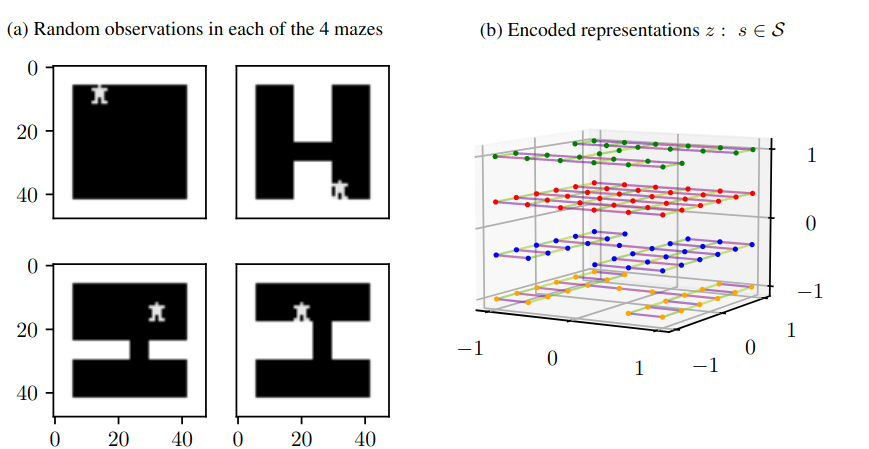

# Disentangled (Un)Controllable Features

This is the PyTorch repository for the paper : 

***Disentangled (un)Controllable Features***

By Jacob E. Kooi, Mark Hoogendoorn and Vincent Francois-Lavet 

(Link to Arxiv: --Link--)




**Citation**

If you are using this code or are referrring to our work, please cite the following bibtex: 

```
(--Bibtex--)
```

**Requirements**

Python 3.8.10 was used, and the packages needed to run the code are:

```bash
pip3 install pytorch    # Pytorch 1.12
pip install matplotlib  # Matplotlib 3.6.1
pip install argparse    # Argparse 1.4.0
```

**Four Mazes environment**

To train an encoder and forward predictor for the Four Mazes environment, run:
```bash
python3 main_fourmaze.py --run_description test_fourmaze --iterations 50000
```


**Catcher environment**

To train an encoder and forward predictor for the Catcher environment, run:
```bash
python3 main_catcher.py --run_description test_catcher_1_state --iterations 200000 --agent_dim 1 --entropy_scaler 5
```
or with two agent dimensions:
```bash
python3 main_catcher.py --run_description test_catcher_2_states --iterations 200000 --agent_dim 2 --entropy_scaler 5
```
or with two agent dimensions and adversarial loss:
```bash
python3 main_catcher.py --run_description test_catcher_2_states_adversarial --iterations 200000 --agent_dim 2 --entropy_scaler 5 --adversarial True
```


**Procedural Generated Maze environment**

To train an encoder and forward predictor for the Random Maze environment, run:

```bash
python3 main_multimaze.py --run_description test_multimaze --iterations 250000 --entropy_scaler 13
```
